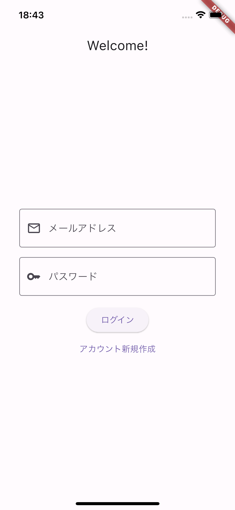
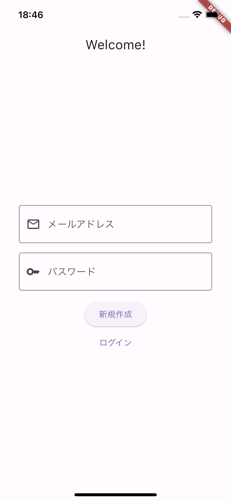
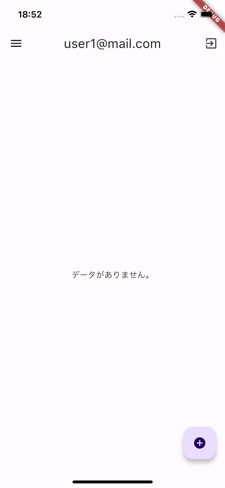
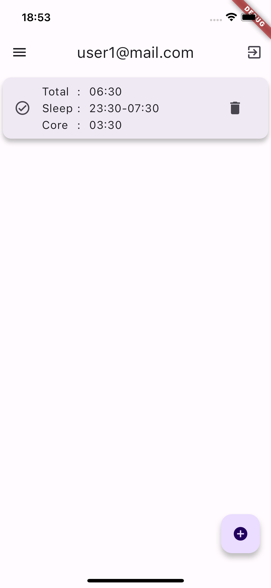
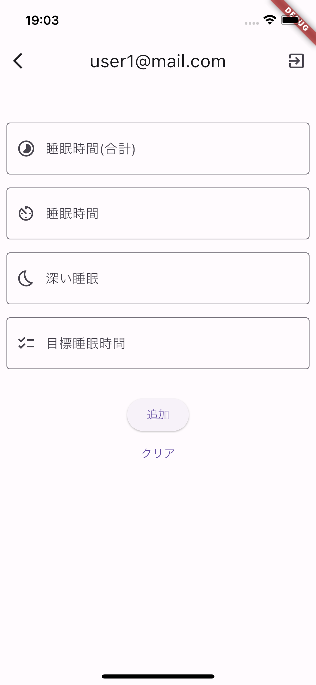
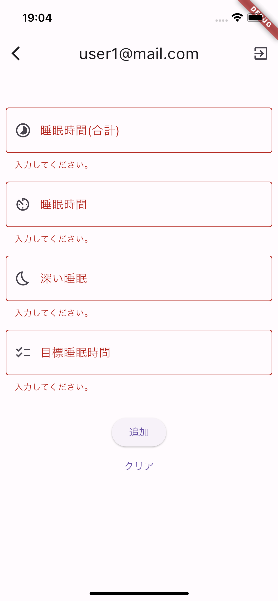
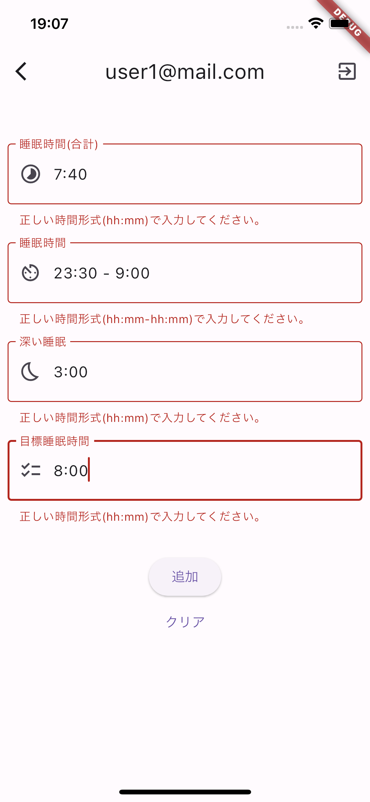
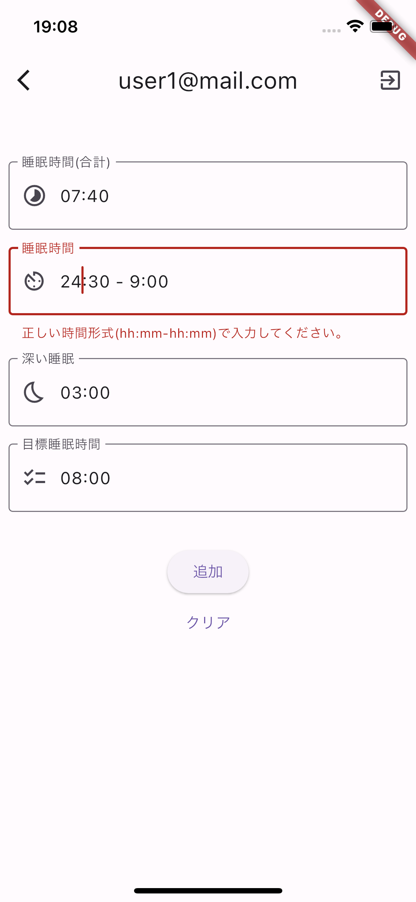
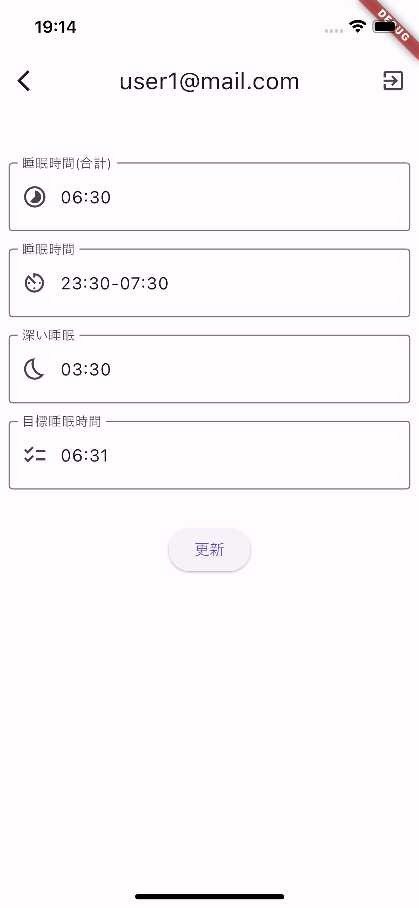

# sleep_management_app
- 睡眠時間記録アプリ

## 画面仕様
### ログイン画面
- Firebase Authentication で管理
- ログイン状態のユーザーには表示しない
- 未ログイン状態のユーザーに表示する
  - 新規作成とログインを切り替える
  - ユーザー未登録の場合はアカウントを新規作成する

ログイン | 新規作成
--- | ---
 | 

---
### 一覧画面
- メニューバータップで一覧画面と追加画面に遷移する
- 右下「+」ボタンタップで追加画面に遷移する
- 右上ログアウトボタンタップでログアウトする
- リストアイテムについて
  - Firestore Database で管理
  - 睡眠時間が目標を達成したかどうかでアイコンが変化する
    - 達成: チェックアイコン
    - 未達成: ベッドアイコン
  - 睡眠時間(合計)、睡眠時間帯、深い睡眠が表示される
  - 削除ボタンタップでデータを削除する
  - リストアイテムタップで編集画面に遷移する

登録データなし | 記録あり(睡眠時間達成) | 記録あり(睡眠時間未達成)
--- | --- | ---
 |  | 

---
### 追加画面
- 追加ボタンタップでデータを登録する
- クリアボタンタップで入力値をクリアする

画面表示時 | 
--- |

- バリデーション
  - 入力値の有無
  - hh:mm形式
  - 00:00から23:59の範囲

入力値がない場合 | hh:mm形式になっていない場合 | 00:00-23:59の範囲外
--- | --- | ---
 |  | 

---
### 編集画面
- デザインは追加画面と同様
- タップしたリストアイテムのデータが入力された状態で表示する

画面表示時 |
--- |

